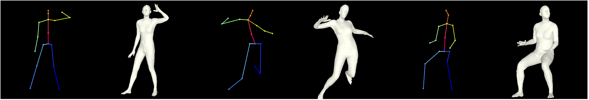
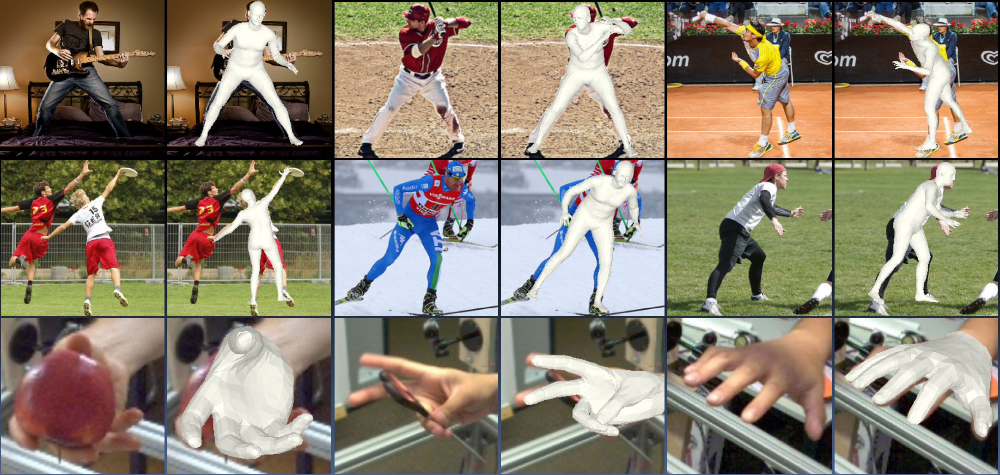
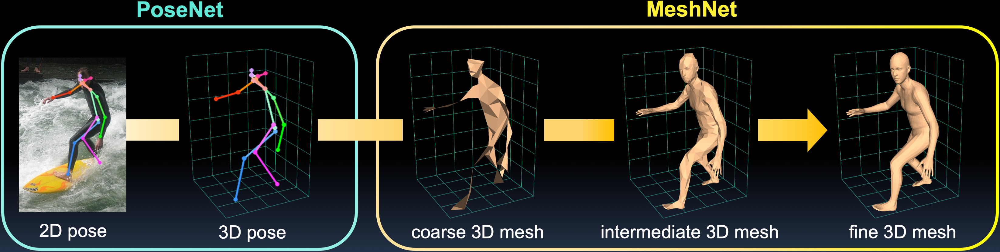
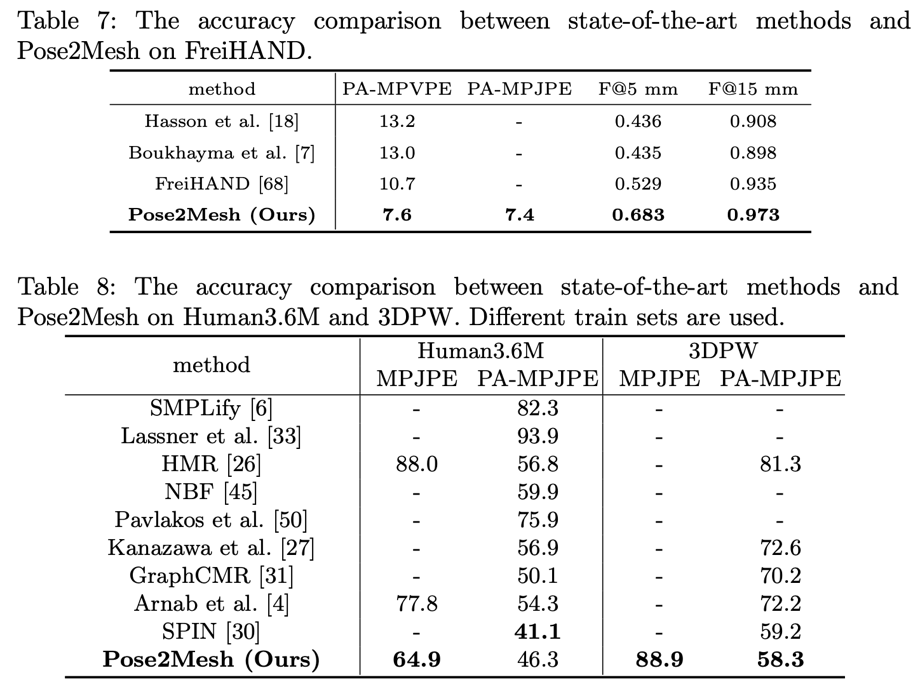
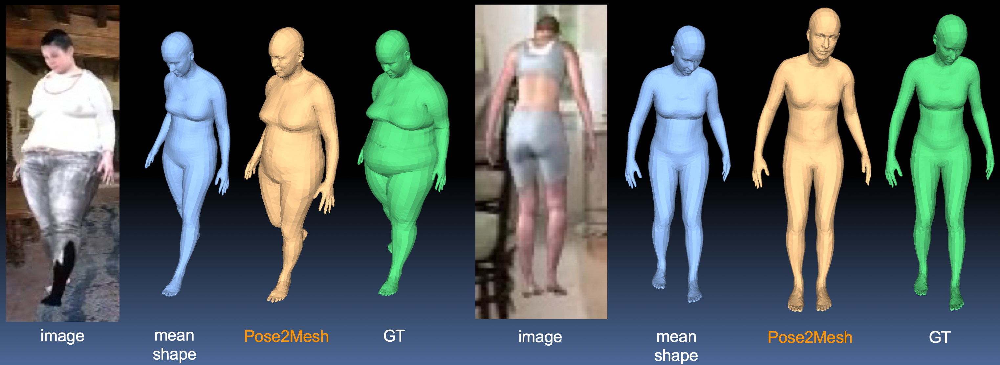
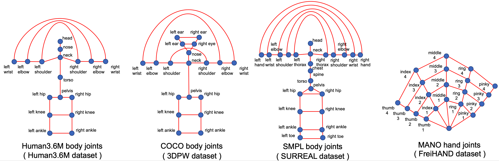

# Pose2Mesh: Graph Convolutional Network for 3D Human Pose and Mesh Recovery from a 2D Human Pose



## News
- Update 21.04.27: Update PoseFix code and AMASS dataloader. Lowered PA-MPJPE, MPVPE on 3DPW!
- Update 21.04.09: Update 3DPW evaluation code. Add temporal smoothing code and PA-MPVPE calculation code. They are commented for faster evaluation, but you can uncomment them in `evaluate` function of `${ROOT}/data/PW3D/dataset.py`. 
- Update 21.04.09: Add demo on multiple people, and make a rendered mesh be overlayed on an input image
- Update 20.11.016: Increased accuracy on 3DPW using DarkPose 2D pose outputs.

## Introduction
This repository is the offical [Pytorch](https://pytorch.org/) implementation of [Pose2Mesh: Graph Convolutional Network for 3D Human Pose and Mesh Recovery from a 2D Human Pose (ECCV 2020)](https://arxiv.org/abs/2008.09047). Below is the overall pipeline of Pose2Mesh.



## Install guidelines
- We recommend you to use an [Anaconda](https://www.anaconda.com/) virtual environment. Install [PyTorch](https://pytorch.org/) >= 1.2 according to your GPU driver and Python >= 3.7.2, and run `sh requirements.sh`. 


## Quick demo
- Download the pre-trained Pose2Mesh according to [this](#pretrained-model-weights).
- Prepare SMPL and MANO layers according to [this](#pytorch-smpl-and-mano-layer).
- Prepare a pose input, for instance, as `input.npy`. `input.npy` should contain the coordinates of 2D human joints, which follow the topology of joint sets defined [here](#start). The joint orders can be found in each `${ROOT}/data/*/dataset.py`.
### Demo on a single person
- Run `python demo/run.py --gpu 0 --input_pose demo/h36m_joint_input.npy --joint_set human36`.
- You can replace `demo/h36m_joint_input.npy` and `human36` with your input numpy file and one of `{human36,coco,smpl,mano}`.
- Add `--input_img {img_path}` on the command if you want to a rendered mesh overlayed on an input image.
- The outputs `demo_pose2d.png`, `demo_mesh.png`, and `demo_mesh_.obj` will be saved in `${ROOT}/demo/result/`.
### Demo on multiple people
- Download demo input from [here](https://drive.google.com/drive/folders/1Vk-R_9MdoRflclfN2iQVWjxlFAHHe4bG?usp=sharing) and place them under `${ROOT}/demo/`.
- Run `python demo/run.py --gpu 0`.
- Outputs on a sampled image from [CrowdPose datasest](https://github.com/MVIG-SJTU/AlphaPose/blob/pytorch/doc/CrowdPose.md) will be saved in `${ROOT}/demo/result/`.
- You can change an input image and some details in lines 264~278 of `${ROOT}/demo/run.py`.

## Results
Here I report the performance of Pose2Mesh.

:muscle: __Update:__ We increased the performance on 3DPW using GT meshes obtained from [NeuralAnnot](https://arxiv.org/abs/2011.11232) on COCO and AMASS. The annotations from NeuralAnnot are yet to be released.  
:muscle: __Update:__ The performance on 3DPW has increased using [DarkPose](https://github.com/ilovepose/DarkPose) 2D detection, which improved [HRNet](https://github.com/leoxiaobin/deep-high-resolution-net.pytorch).



Below shows the results when the input is **groundtruth** 2D human poses.
For Human3.6M benchmark, Pose2Mesh is trained on Human3.6M.
For 3DPW benchmark, Pose2Mesh is trained on Human3.6M and COCO.

| | MPJPE | PA-MPJPE |
|:---:|:---:|:---:|
| Human36M | 51.28 mm | 35.61 mm |
| 3DPW | 63.10 mm | 35.37 mm |

We provide qualitative results on SURREAL to show that Pose2Mesh can recover 3D shape to some degree.
Please refer to the [paper](https://arxiv.org/abs/2008.09047) for more discussion.


## Directory

### Root

The `${ROOT}` is described as below.

```
${ROOT} 
|-- data
|-- demo
|-- lib
|-- experiment
|-- main
|-- manopth
|-- smplpytorch
```
- `data` contains data loading codes and soft links to images and annotations directories.
- `demo` contains demo codes.
- `lib` contains kernel codes for Pose2Mesh.
- `main` contains high-level codes for training or testing the network.
- `experiment` contains the outputs of the system, whic include train logs, trained model weights, and visualized outputs.

### Data

The `data` directory structure should follow the below hierarchy.
```
${ROOT}  
|-- data  
|   |-- Human36M  
|   |   |-- images  
|   |   |-- annotations   
|   |   |-- J_regressor_h36m_correct.npy
|   |   |-- absnet_output_on_testset.json 
|   |-- MuCo  
|   |   |-- data  
|   |   |   |-- augmented_set  
|   |   |   |-- unaugmented_set  
|   |   |   |-- MuCo-3DHP.json
|   |   |   |-- smpl_param.json
|   |-- COCO  
|   |   |-- images  
|   |   |   |-- train2017  
|   |   |   |-- val2017  
|   |   |-- annotations  
|   |   |-- J_regressor_coco.npy
|   |   |-- hrnet_output_on_valset.json
|   |-- PW3D 
|   |   |-- data
|   |   |   |-- 3DPW_latest_train.json
|   |   |   |-- 3DPW_latest_validation.json
|   |   |   |-- darkpose_3dpw_testset_output.json
|   |   |   |-- darkpose_3dpw_validationset_output.json
|   |   |-- imageFiles
|   |-- AMASS
|   |   |-- data
|   |   |   |-- cmu
|   |-- SURREAL
|   |   |-- data
|   |   |   |-- train.json
|   |   |   |-- val.json
|   |   |   |-- hrnet_output_on_testset.json
|   |   |   |-- simple_output_on_testset.json
|   |   |-- images
|   |   |   |-- train
|   |   |   |-- test
|   |   |   |-- val
|   |-- FreiHAND
|   |   |-- data
|   |   |   |-- training
|   |   |   |-- evaluation
|   |   |   |-- freihand_train_coco.json
|   |   |   |-- freihand_train_data.json
|   |   |   |-- freihand_eval_coco.json
|   |   |   |-- freihand_eval_data.json
|   |   |   |-- hrnet_output_on_testset.json
|   |   |   |-- simple_output_on_testset.json
```
- Download Human3.6M parsed data and SMPL parameters [[data](https://drive.google.com/drive/folders/1kgVH-GugrLoc9XyvP6nRoaFpw3TmM5xK)][[SMPL parameters from SMPLify-X](https://drive.google.com/drive/folders/1s-yywb4zF_OOLMmw1rsYh_VZFilgSrrD)]
- Download MuCo parsed/composited data and SMPL parameters [[data](https://drive.google.com/drive/folders/1yL2ey3aWHJnh8f_nhWP--IyC9krAPsQN)][[SMPL parameters from SMPLify-X](https://drive.google.com/drive/folders/1_JrrbHZICDTe1lqi8S6D_Y1ObmrerAoU?usp=sharing)]
- Download COCO SMPL parameters [[SMPL parameters from SMPLify](https://drive.google.com/drive/folders/1X7OMEGQJOe0Tcn2GvvP1koKkq4yghIzr?usp=sharing)]  
- Download AMASS SMPL parameters [[offical site](https://amass.is.tue.mpg.de/)]
- Download SURREAL parsed data [[data](https://drive.google.com/drive/folders/1vvJXM0WYzbkjTTVAFsfXRAdyAwAhEPPh?usp=sharing)] 
- Download 3DPW parsed data [[data](https://drive.google.com/drive/folders/1pT0Ix3FxieEQf0HhEbMN1o-DWRzw2Ugh?usp=sharing)]
- Download FreiHAND parsed data [[data](https://drive.google.com/drive/folders/1syj8KEGxHV6lXGOStJGJ6qGaIol-4xD7?usp=sharing)] (`bbox` in `freihand_eval_coco.json` is from [Detectron2](https://github.com/facebookresearch/detectron2))
- All annotation files follow [MS COCO format](https://cocodataset.org/#format-data).
- If you want to add your own dataset, you have to convert it to [MS COCO format](https://cocodataset.org/#format-data).
- Images need to to be downloaded, but if needed you can download them from their offical sites.
- 2D pose detection outputs can be downloaded here: [Human36M](https://drive.google.com/drive/folders/1iRuNa6CqoHbloJ-wFPpW6g72QmP9xZT-?usp=sharing), [COCO](https://drive.google.com/drive/folders/1x0lLocLWloN813njSTsP0K09opTcLULE?usp=sharing), [3DPW](https://drive.google.com/drive/folders/1qt5R4wMTP1FSUtSi52lUke3EQazNkqVh?usp=sharing), [SURREAL](https://drive.google.com/drive/folders/1dkHOZwaflluUCPZpbLwio9s3kN1QwHz8?usp=sharing), [FreiHAND](https://drive.google.com/drive/folders/1QfAoCNTuQKbFTIoS5p9Hm_4IRdM5xVif?usp=sharing)

If you have a problem with 'download limit' when trying to download datasets from google drive links, please try this trick.
>* Go the shared folder, which contains files you want to copy to your drive  
>* Select all the files you want to copy  
>* In the upper right corner click on three vertical dots and select “make a copy”  
>* Then, the file is copied to your personal google drive account. You can download it from your personal account.  

### Pytorch SMPL and MANO layer

- For the SMPL layer, I used [smplpytorch](https://github.com/gulvarol/smplpytorch). The repo is already included in `${ROOT}/smplpytorch`.
- Download `basicModel_f_lbs_10_207_0_v1.0.0.pkl`, `basicModel_m_lbs_10_207_0_v1.0.0.pkl`, and `basicModel_neutral_lbs_10_207_0_v1.0.0.pkl` from [here](https://smpl.is.tue.mpg.de/download.php) (female & male) and [here](http://smplify.is.tue.mpg.de/) (neutral) to `${ROOT}/smplpytorch/smplpytorch/native/models`.
For the MANO layer, I used [manopth](https://github.com/hassony2/manopth). The repo is already included in `${ROOT}/manopth`.
Download `MANO_RIGHT.pkl` from [here](https://mano.is.tue.mpg.de/downloads) at `${ROOT}/manopth/mano/models`.

### Experiment

The `experiment` directory will be created as below.
```
${ROOT}  
|-- experiment  
|   |-- exp_*  
|   |   |-- checkpoint  
|   |   |-- graph 
|   |   |-- vis 
```

- `experiment` contains train/test results of Pose2Mesh on various benchmark datasets.
We recommed you to create the folder as a soft link to a directory with large storage capacity.

- `exp_*` is created for each train/test command. 
The wildcard symbol refers to the time of the experiment train/test started.
Default timezone is UTC+9, but you can set to your local time.

- `checkpoint` contains the model checkpoints for each epoch. 

- `graph` contains visualized train logs of error and loss. 

- `vis` contains `*.obj` files of meshes and images with 2D human poses or human meshes. 

### Pretrained model weights
Download pretrained model weights from [here](https://drive.google.com/drive/folders/1HayITLQYf6d43ksShRYF3CU6KDKd84Kn?usp=sharing) to a corresponding directory.
```
${ROOT}  
|-- experiment  
|   |-- posenet_human36J_train_human36 
|   |-- posenet_cocoJ_train_human36_coco_muco
|   |-- posenet_smplJ_train_surreal
|   |-- posenet_manoJ_train_freihand
|   |-- pose2mesh_human36J_train_human36
|   |-- pose2mesh_cocoJ_train_human36_coco_muco
|   |-- pose2mesh_smplJ_train_surreal
|   |-- pose2mesh_manoJ_train_freihand
|   |-- posenet_human36J_gt_train_human36
|   |-- posenet_cocoJ_gt_train_human36_coco
|   |-- pose2mesh_human36J_gt_train_human36
|   |-- pose2mesh_cocoJ_gt_train_human36_coco
```

## Running Pose2Mesh



### Start
- Pose2Mesh uses different joint sets from Human3.6M, COCO, SMPL, and MANO for Human3.6M, 3DPW, SURREAL, and FreiHAND benchmarks respectively. For the COCO joint set, we manually add 'Pelvis' and 'Neck' joints by computing the middle point of 'L_Hip' and 'R_Hip', and 'L_Shoulder' and 'R_Shoulder' respectively.
- In the `lib/core/config.py`, you can change settings of the system including a train/test dataset to use, a pre-defined joint set, a pre-trained PoseNet, a learning schedule, GT usage, and so on. 
- Note that the first dataset on the `DATASET.{train/test}_list` should call `build_coarse_graphs` function for the graph convolution setting. Refer to the last line of `__init__` function in `${ROOT}/data/Human36M/dataset.py`. 


### Train

Select the config file in `${ROOT}/asset/yaml/` and train. You can change the train set and pretrained posenet by your own `*.yml` file. 

**1. Pre-train PoseNet**

To train from the scratch, you should pre-train PoseNet first.

Run
```
python main/train.py --gpu 0,1,2,3 --cfg ./asset/yaml/posenet_{input joint set}_train_{dataset list}.yml
```

**2. Train Pose2Mesh**

Copy `best.pth.tar` in `${ROOT}/experiment/exp_*/checkpoint/` to `${ROOT}/experiment/posenet_{input joint set}_train_{dataset list}/`. Or download the pretrained weights following [this](#pretrained-model-weights).

Run
```
python main/train.py --gpu 0,1,2,3 --cfg ./asset/yaml/pose2mesh_{input joint set}_train_{dataset list}.yml
```


### Test

Select the config file in `${ROOT}/asset/yaml/` and test. You can change the pretrained model weight. To save sampled outputs to `obj` files, change `TEST.vis` value to `True` in the config file.

Run
```
python main/test.py --gpu 0,1,2,3 --cfg ./asset/yaml/{model name}_{input joint set}_test_{dataset name}.yml
```

### Reference
```
@InProceedings{Choi_2020_ECCV_Pose2Mesh,  
author = {Choi, Hongsuk and Moon, Gyeongsik and Lee, Kyoung Mu},  
title = {Pose2Mesh: Graph Convolutional Network for 3D Human Pose and Mesh Recovery from a 2D Human Pose},  
booktitle = {European Conference on Computer Vision (ECCV)},  
year = {2020}  
}  
```
